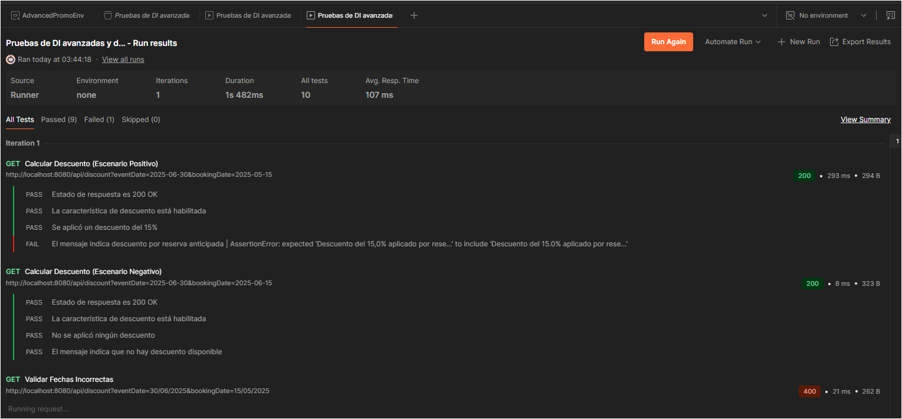

# LAB Java | Advanced DI & Postman Power-Up

## Introduction

In this lab, you will build a more advanced Spring Boot application that conditionally enables a new feature called **EarlyBirdDiscountService**. This service will calculate a discount for early bookings based on configurable criteria. You will then create a series of automated Postman tests to verify the behavior of your endpoint under different conditions. The lab challenges you to integrate advanced dependency injection techniques with dynamic API test automation—pushing you to design and test a feature beyond the basic examples provided in class.

<br />

## Requirements

1. Fork this repo.
2. Clone this repo.
3. Add your instructor and the class graders as collaborators to your repository. If you are unsure who your class graders are, ask your instructor or refer to the day 1 slide deck.
4. In the repository, create a Java project and add the code for the following prompts.

<br />

## Submission

Once you finish the assignment, submit a URL link to your repository or your pull request in the field below.

<br />

## Instructions

### 1. Build the Spring Boot Application

- **Conditional Bean Setup:**

  - Create a configuration class (e.g., `DiscountFeatureConfig`) that defines a bean for a service named **EarlyBirdDiscountService**.
  - Configure the bean with `@ConditionalOnProperty` so that it is loaded only when a property (e.g., `feature.earlybird.enabled`) is set to `true`.

- **Service Implementation:**

  - Design the **EarlyBirdDiscountService** to include a method that calculates a discount percentage. The discount should be determined by the booking date relative to the event date (for example, bookings made at least 30 days in advance receive a 15% discount).
  - The service should handle various scenarios (e.g., no discount if the booking is too late) and return an appropriate message or discount value.

- **REST Controller:**

  - Develop a REST controller (e.g., `DiscountController`) that uses constructor-based DI to inject the **EarlyBirdDiscountService**.
  - Expose an endpoint (e.g., `GET /api/discount`) that:
    - Accepts query parameters for the event date and booking date.
    - Returns the calculated discount if the service is active.
    - Handles the scenario gracefully when the service is not enabled (e.g., returns a suitable error message or HTTP status).

- **Application Configuration:**
  - In your `application.properties` file, add the property `feature.earlybird.enabled` and set it to either `true` or `false`.

<br />

### 2. Develop and Automate Postman Tests

- **Environment Setup:**

  - Create a new Postman environment named “AdvancedPromoEnv.”
  - Define a variable `baseUrl` with the value pointing to your Spring Boot application (e.g., `http://localhost:8080`).

- **Collection Creation:**

  - Create a Postman collection titled “Advanced DI & Early Bird Discount Tests.”

- **Design the Following Requests:**

  - **GET Request (Calculate Discount):**
    - **Method:** GET
    - **URL:** `{{baseUrl}}/api/discount`
    - **Query Parameters:** Include parameters for `eventDate` and `bookingDate` (e.g., `eventDate=2025-06-30`, `bookingDate=2025-05-15`).
    - **Goal:** Verify that when `feature.earlybird.enabled` is `true`, the endpoint returns the correct discount message or value.
  - **Negative Test Request:**
    - Change the query parameters (e.g., booking closer to the event date) to test the edge cases, verifying that no discount is applied when appropriate.

- **Add Scripts:**

  - **Pre-request Script:** (Optional) Log a message to indicate that the request is starting.
  - **Post-response Script:** Write a script that validates:
    - The response status code.
    - That the response contains a discount value or message consistent with your business rules.
    - Optionally, log key output for debugging purposes.

- **Run and Validate:**
  - Use the Postman Collection Runner to execute your requests.
  - Test both the positive (discount applied) and negative (no discount) scenarios by toggling the property `feature.earlybird.enabled` and by varying the query parameters.

<br />

### 3. Documentation in README.md

Update your repository’s `README.md` to include:

- A brief explanation of your design choices for the **EarlyBirdDiscountService**.

  Este proyecto implementa un servicio de descuento por reserva anticipada utilizando Spring Boot con inyección de dependencias (DI) avanzada y configuración de beans condicionales.
  Diseño del Servicio
  El EarlyBirdDiscountService está diseñado para calcular descuentos basados en la fecha de reserva en relación con la fecha del evento. Las características principales incluyen:

Regla de descuento: Se aplica un descuento del 15% cuando una reserva se realiza con al menos 30 días de anticipación a la fecha del evento.
Validación de fechas: El servicio valida que las fechas proporcionadas sean coherentes (por ejemplo, la fecha de reserva no puede ser posterior a la fecha del evento).
Objeto de resultado estructurado: El servicio devuelve un objeto DiscountResult que contiene tanto el porcentaje de descuento como un mensaje descriptivo.
Configuración condicional: El servicio está configurado con @ConditionalOnProperty para que solo se active cuando la propiedad feature.earlybird.enabled esté establecida en true.

- **Answers to:
  - Why did you choose constructor-based DI for this lab?**
  
  
    La inyección de dependencias basada en constructor se eligió por varias razones importantes:

    Inmutabilidad: Al utilizar campos finales e inyección a través del constructor, se garantiza que las dependencias no puedan cambiarse después de la creación del objeto, lo que mejora la seguridad y previsibilidad del código.
    Claridad en dependencias: El constructor hace explícitas las dependencias que requiere la clase, lo que mejora la legibilidad y el entendimiento del código.
    Facilidad para pruebas: La DI basada en constructor facilita la creación de pruebas unitarias, ya que permite inyectar fácilmente mocks o stubs de las dependencias.
    Manejo de dependencias opcionales: Como se muestra en DiscountController, podemos usar @Autowired(required = false) para manejar elegantemente escenarios donde la dependencia podría no estar disponible, lo cual es crucial cuando trabajamos con beans condicionales.
    Mejor soporte para inmutabilidad y programación funcional: La DI basada en constructor se alinea mejor con los principios de inmutabilidad, lo que facilita el razonamiento sobre el comportamiento del código.


  - **What advantages do Postman pre-request and post-response scripts offer for automated testing?**

  
    Los scripts de pre-solicitud y post-respuesta en Postman ofrecen varias ventajas significativas:

    Preparación del entorno: Los scripts de pre-solicitud permiten establecer variables, realizar cálculos o registrar información antes de que se ejecute la solicitud, lo que ayuda a crear un entorno controlado para la prueba.
    Validación automática: Los scripts post-respuesta permiten verificar automáticamente que la respuesta cumple con criterios específicos, como códigos de estado, estructura de respuesta y valores esperados.
    Documentación en tiempo real: Al registrar información relevante, estos scripts proporcionan una documentación en tiempo real del comportamiento de la API, lo que facilita la identificación de problemas.
    Pruebas condicionales: Permiten la ejecución de pruebas basadas en condiciones específicas, lo que facilita la creación de flujos de prueba más complejos y realistas.
    Registro y depuración: El registro de información antes y después de las solicitudes facilita la identificación y resolución de problemas durante el desarrollo.


  - **How does your application behave when the early bird feature is disabled?**

  
    Cuando la función de reserva anticipada está deshabilitada (es decir, cuando feature.earlybird.enabled=false en el archivo application.properties):

    Bean no disponible: Spring no creará el bean EarlyBirdDiscountService debido a la anotación @ConditionalOnProperty.
    Inyección nula: En el DiscountController, la inyección del servicio resultará en un valor nulo, lo cual es manejado gracias a @Autowired(required = false).
    Comportamiento gracioso: Cuando se realiza una solicitud al endpoint /api/discount, el controlador detecta que el servicio no está disponible y devuelve una respuesta clara indicando que "La característica de descuento por reserva anticipada está deshabilitada".
    Respuesta estructurada: La respuesta mantiene la misma estructura, incluyendo un porcentaje de descuento de 0%, un mensaje explicativo y un indicador featureEnabled establecido en false.

    Este enfoque permite desactivar características específicas sin necesidad de modificar el código o reiniciar la aplicación, lo que es ideal para implementar estrategias de lanzamiento gradual o pruebas A/B.

  - **What are some challenges you faced when integrating advanced DI with API testing?**


    Manejo de beans condicionales: Uno de los principales desafíos fue diseñar un sistema que pudiera funcionar correctamente tanto cuando el servicio de descuento estaba habilitado como cuando no lo estaba, lo que requirió un cuidadoso manejo de la inyección de dependencias y comprobaciones de nulidad.
    Pruebas para múltiples configuraciones: Diseñar pruebas que pudieran verificar el comportamiento del sistema en diferentes configuraciones (habilitado/deshabilitado) requirió un enfoque más complejo que las pruebas estándar.
    Mensajes de error coherentes: Garantizar que la API proporcionara mensajes de error claros y útiles en todos los escenarios posibles fue un desafío, especialmente para mantener una experiencia de usuario consistente.
    Validación de fechas: Manejar diferentes formatos de fecha y posibles errores de parseo mientras se mantenía una API robusta requirió implementar una validación y manejo de errores cuidadosos.
    Scripts de prueba dinámicos: Crear scripts de Postman que pudieran adaptarse a diferentes respuestas basadas en la configuración del sistema requirió un enfoque más sofisticado para las pruebas automatizadas.

<br />

## FAQs

<br>

<details>
  <summary style="font-size: 16px; cursor: pointer; outline: none; font-weight: bold;">I am stuck and don't know how to solve the problem or where to start. What should I do?</summary>

<br> <!-- ✅ -->

If you are stuck in your code and don't know how to solve the problem or where to start, you should take a step back and try to form a clear, straight forward question about the specific issue you are facing. The process you will go through while trying to define this question, will help you narrow down the problem and come up with potential solutions.

For example, are you facing a problem because you don't understand the concept or are you receiving an error message that you don't know how to fix? It is usually helpful to try to state the problem as clearly as possible, including any error messages you are receiving. This can help you communicate the issue to others and potentially get help from classmates or online resources.

Once you have a clear understanding of the problem, you should be able to start working toward the solution.

</details>

<br>

<details>
  <summary style="font-size: 16px; cursor: pointer; outline: none; font-weight: bold;">How do I create a Spring boot project?</summary>

<br> <!-- ✅ -->

Spring boot is a framework for creating stand-alone, production-grade applications that are easy to launch and run. The best way to create a Spring boot project is to use the Spring Initializer website. The website provides a convenient way to generate a basic project structure with all the necessary dependencies and configurations.

- Step 1: Go to [start.spring.io](https://start.spring.io/)
- Step 2: Choose the type of project you want to create, such as Maven or Gradle.
- Step 3: Select the version of Spring Boot you want to use.
- Step 4: Choose the dependencies you need for your project. Some common dependencies include web, jpa and data-jpa.
- Step 5: Click the "Generate" button to download the project files.

Alternatively, you can use an Integrated Development Environment (IDE) such as Eclipse or IntelliJ IDEA. These IDEs have plugins for creating Spring boot projects, making it easy to set up the environment and get started with coding.

 </details>

<br>

<details>
  <summary style="font-size: 16px; cursor: pointer; outline: none; font-weight: bold;">What if my Postman tests don't pass?</summary>

<br> <!-- ✅ -->

- Ensure your `baseUrl` environment variable is correctly set.
- Verify that your application is running and accessible.
- Check your pre-request and post-response scripts for typos or logical errors.
- Use the Postman Console (View > Show Postman Console) to debug and view logs.

  <br>

</details>

<br>

<details>
  <summary style="font-size: 16px; cursor: pointer; outline: none; font-weight: bold;">How do I debug issues with conditional bean loading?</summary>
  
  <br />
  
  - Check your `application.properties` to ensure the correct values are set.
  - Use logging in your configuration and service classes to confirm whether beans are being instantiated.
  - Review your IDE’s console output and Spring Boot startup logs for any conditional configuration warnings or errors.
  
  <br />
</details>

<br>

<details>
  <summary style="font-size: 16px; cursor: pointer; outline: none; font-weight: bold;">I am unable to push changes to my repository. What should I do?</summary>

<br> <!-- ✅ -->

If you are unable to push changes to your repository, here are a few steps that you can follow:

1. Check your internet connection: Ensure that your internet connection is stable and working.
1. Verify your repository URL: Make sure that you are using the correct repository URL to push your changes.
1. Check Git credentials: Ensure that your Git credentials are up-to-date and correct. You can check your credentials using the following command:

```bash
git config --list
```

4. Update your local repository: Before pushing changes, make sure that your local repository is up-to-date with the remote repository. You can update your local repository using the following command:

```bash
git fetch origin
```

5. Check for conflicts: If there are any conflicts between your local repository and the remote repository, resolve them before pushing changes.
6. Push changes: Once you have resolved any conflicts and updated your local repository, you can try pushing changes again using the following command:

```bash
git push origin <branch_name>
```

</details>
